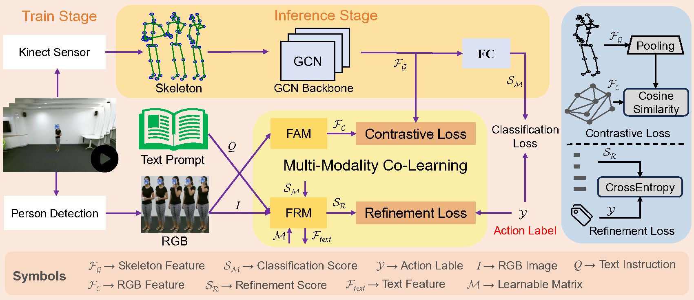

# Multi-Modality Co-Learning for Efficient Skeleton-based Action Recognition
This is the official repo of **Multi-Modality Co-Learning for Efficient Skeleton-based Action Recognition**. <br />
The complete code and the detailed reproduction steps will be uploaded soon. <br />

<!--
# Download dataset
1. **NTU-RGB+D 60** dataset from [https://rose1.ntu.edu.sg/dataset/actionRecognition/](https://rose1.ntu.edu.sg/dataset/actionRecognition/)
2. **NTU-RGB+D 120** dataset from [https://rose1.ntu.edu.sg/dataset/actionRecognition/](https://rose1.ntu.edu.sg/dataset/actionRecognition/)
3. **NW-UCLA** dataset from [https://wangjiangb.github.io/my_data.html](https://wangjiangb.github.io/my_data.html)
4. **UTD-MHAD** dataset from [https://www.utdallas.edu/~kehtar/UTD-MHAD.html](https://www.utdallas.edu/~kehtar/UTD-MHAD.html)
5. **SYSU-Action** dataset from [https://www.isee-ai.cn/%7Ehujianfang/ProjectJOULE.html](https://www.isee-ai.cn/%7Ehujianfang/ProjectJOULE.html)

# Process dataset
1. Refer to the method of [CTR-GCN](https://github.com/Uason-Chen/CTR-GCN) or [TD-GCN](https://github.com/liujf69/TD-GCN-Gesture) for processing and preserving the skeleton data.
2. Refer to the method of [Extract_NTU_Person](https://github.com/liujf69/Data-Processing/tree/master/Extract_NTU_Person) for processing and preserving the Video data.
3. Refer to the method of [LLMs](https://github.com/liujf69/MMCL-Action/tree/main/LLMs) for get the text features. [MiniGPT-4](https://github.com/Vision-CAIR/MiniGPT-4), [BLIP](https://github.com/salesforce/BLIP), [DeepSeek-VL](https://github.com/deepseek-ai/DeepSeek-VL), [GLM-4](https://github.com/THUDM/GLM-4).
```
Frist, you must git clone the project of the multimodal LLMs.
Then, you need to preserve the text features, not the text content.
We suggest adopting more advanced multimodal LLMs (e.g. GLM-4V and DeepSeek-VL) to obtain text features.
```

# Train Model
Please store the data of different modalities in the specified path and modify the config file accordingly.
```
python main.py --device 0 1 --config ./config/nturgbd120-cross-subject/joint.yaml
```
# Test Model
```
python main.py --device 0 --config ./config/nturgbd120-cross-subject/joint.yaml --phase test --weights <work_dir>/NTU120-XSub.pt
```

# Thanks
Our project is based on the [CTR-GCN](https://github.com/Uason-Chen/CTR-GCN), [TD-GCN](https://github.com/liujf69/TD-GCN-Gesture), [EPP-Net](https://github.com/liujf69/EPP-Net-Action), [BLIP](https://github.com/salesforce/BLIP), [MiniGPT-4](https://github.com/Vision-CAIR/MiniGPT-4).

# Citation
```
@inproceedings{liu2024mmcl,
  author = {Liu, Jinfu and Chen, Chen and Liu, Mengyuan},
  title = {Multi-Modality Co-Learning for Efficient Skeleton-based Action Recognition}, 
  booktitle = {Proceedings of the xxxx}, 
  year = {2024}
}
```
-->
# Contact
For any questions, feel free to contact: ```liujf69@mail2.sysu.edu.cn```
