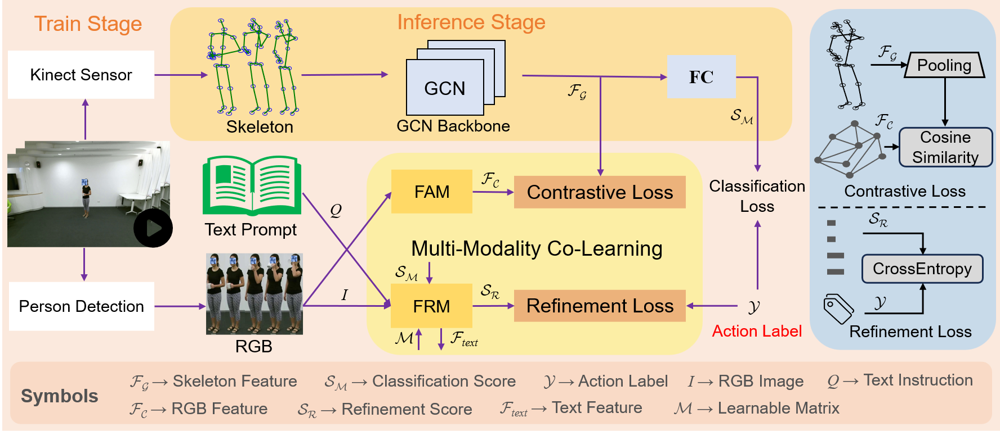
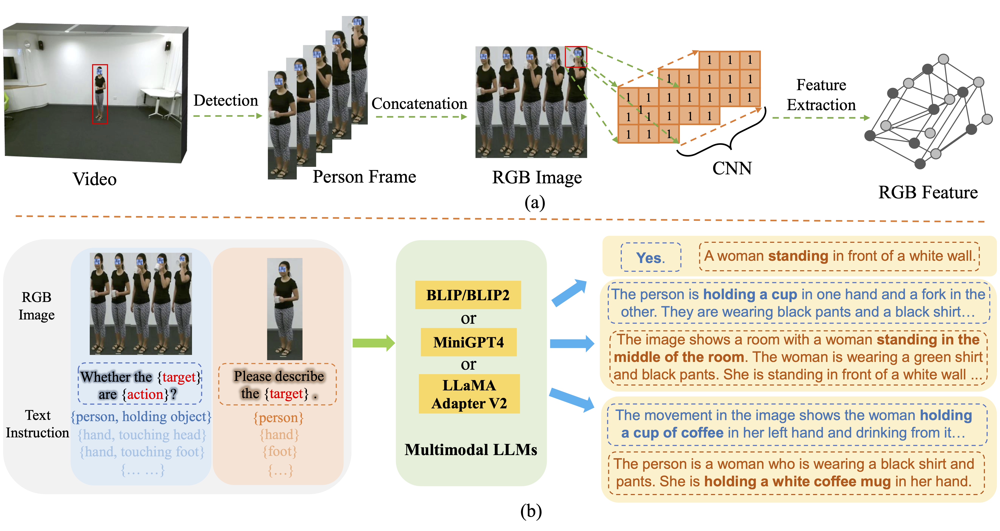

# Multi-Modality Co-Learning for Efficient Skeleton-based Action Recognition
This is the official repo of **Multi-Modality Co-Learning for Efficient Skeleton-based Action Recognition** and our work is accepted by **ACM Multimedia 2024** (**ACM MM**). <br />
[](https://arxiv.org/abs/2407.15706) <br />
[](https://paperswithcode.com/sota/skeleton-based-action-recognition-on-ntu-rgbd-1?p=multi-modality-co-learning-for-efficient-1) <br />
[](https://paperswithcode.com/sota/skeleton-based-action-recognition-on-ntu-rgbd?p=multi-modality-co-learning-for-efficient-1) <br />
[](https://paperswithcode.com/sota/skeleton-based-action-recognition-on-n-ucla?p=multi-modality-co-learning-for-efficient-1) <br />
[[Poster]](./Poster.pdf) <br />
<div align=center>

</div>

# Download dataset
1. **NTU-RGB+D 60** dataset from [https://rose1.ntu.edu.sg/dataset/actionRecognition/](https://rose1.ntu.edu.sg/dataset/actionRecognition/)
2. **NTU-RGB+D 120** dataset from [https://rose1.ntu.edu.sg/dataset/actionRecognition/](https://rose1.ntu.edu.sg/dataset/actionRecognition/)
3. **NW-UCLA** dataset from [https://wangjiangb.github.io/my_data.html](https://wangjiangb.github.io/my_data.html)
4. **UTD-MHAD** dataset from [https://www.utdallas.edu/~kehtar/UTD-MHAD.html](https://www.utdallas.edu/~kehtar/UTD-MHAD.html)
5. **SYSU-Action** dataset from [https://www.isee-ai.cn/%7Ehujianfang/ProjectJOULE.html](https://www.isee-ai.cn/%7Ehujianfang/ProjectJOULE.html)

# Process dataset
1. Refer to the method of [CTR-GCN](https://github.com/Uason-Chen/CTR-GCN) or [TD-GCN](https://github.com/liujf69/TD-GCN-Gesture) for processing and preserving the skeleton data.
2. Refer to the method of [Extract_NTU_Person](https://github.com/liujf69/Data-Processing/tree/master/Extract_NTU_Person) for processing and preserving the Video data.
3. Refer to the method of [LLMs](https://github.com/liujf69/MMCL-Action/tree/main/LLMs) for get the text features. [MiniGPT-4](https://github.com/Vision-CAIR/MiniGPT-4), [BLIP](https://github.com/salesforce/BLIP), [DeepSeek-VL](https://github.com/deepseek-ai/DeepSeek-VL), [GLM-4](https://github.com/THUDM/GLM-4).
```
Frist, you must git clone the project of the multimodal LLMs.
Then, you need to preserve the text features, not the text content.
We suggest adopting more advanced multimodal LLMs (e.g. GLM-4V and DeepSeek-VL) and more complex prompts to obtain text features.
```
<div align=center>

</div>

# Train Model
Please store the data of different modalities in the specified path and modify the config file accordingly.
```
# NTU120-XSub
python main_MMCL.py --device 0 1 --config ./config/nturgbd120-cross-subject/joint.yaml

# NTU120-XSet
python main_MMCL.py --device 0 1 --config ./config/nturgbd120-cross-set/joint.yaml

# NTU60-XSub
python main_MMCL.py --device 0 1 --config ./config/nturgbd-cross-subject/joint.yaml

# NTU60-XView
python main_MMCL.py --device 0 1 --config ./config/nturgbd-cross-view/joint.yaml
```
# Test Model
```
# NTU120-XSub
python main_MMCL.py --device 0 --config ./config/nturgbd120-cross-subject/joint.yaml --phase test --weights <work_dir>/NTU120-XSub.pt

# NTU120-XSet
python main_MMCL.py --device 0 --config ./config/nturgbd120-cross-set/joint.yaml --phase test --weights <work_dir>/NTU120-XSet.pt

# NTU60-XSub
python main_MMCL.py --device 0 --config ./config/nturgbd-cross-subject/joint.yaml --phase test --weights <work_dir>/NTU60-XSub.pt

# NTU60-XView
python main_MMCL.py --device 0 --config ./config/nturgbd-cross-view/joint.yaml --phase test --weights <work_dir>/NTU60-XView.pt
```

# Result
| Method | NTU-60 X-Sub | NTU-60 X-View | NTU-120 X-Sub | NTU-120 X-Set | NW-UCLA |
| ------ | ------------ | ------------- | ------------- | ------------- | -------
|  MMCL  |     93.5%    |      97.4%    |      90.3%    |      91.7%    |  97.5%  |
```python
cd Ensemble
# NTU120-XSub
python ensemble.py \
--J_Score ./Score/NTU120_XSub_J.pkl \
--B_Score ./Score/NTU120_XSub_B.pkl \
--JM_Score ./Score/NTU120_XSub_JM.pkl \
--BM_Score ./Score/NTU120_XSub_BM.pkl \
--HDJ_Score ./Score/NTU120_XSub_HDJ.pkl \
--HDB_Score ./Score/NTU120_XSub_HDB.pkl \
--val_sample ./Val_Sample/NTU120_XSub_Val.txt \
--benchmark NTU120XSub

# Others are similar to this way.
```


# Thanks
Our project is based on the [CTR-GCN](https://github.com/Uason-Chen/CTR-GCN), [TD-GCN](https://github.com/liujf69/TD-GCN-Gesture), [EPP-Net](https://github.com/liujf69/EPP-Net-Action), [BLIP](https://github.com/salesforce/BLIP), [MiniGPT-4](https://github.com/Vision-CAIR/MiniGPT-4).

# Citation
```
@inproceedings{liu2024mmcl,
  author = {Liu, Jinfu and Chen, Chen and Liu, Mengyuan},
  title = {Multi-Modality Co-Learning for Efficient Skeleton-based Action Recognition}, 
  booktitle = {Proceedings of the ACM Multimedia (ACM MM)}, 
  year = {2024}
}
```
